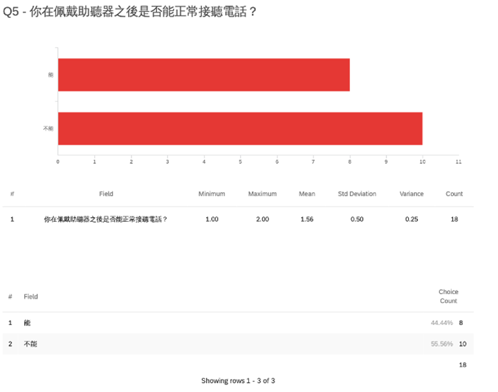
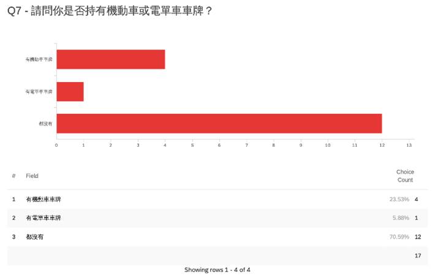
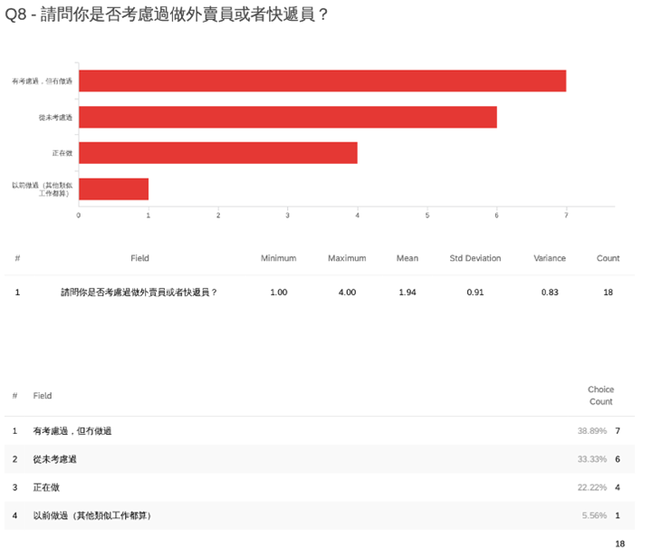
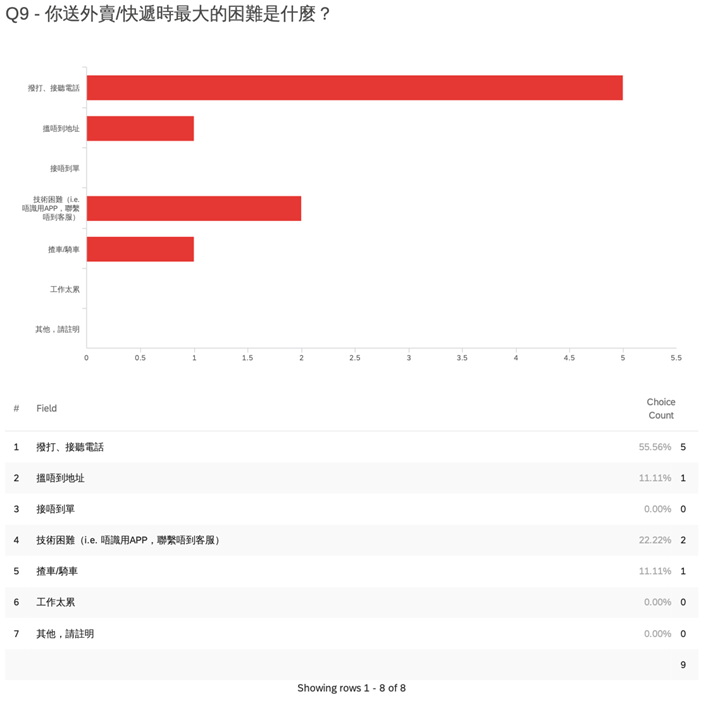
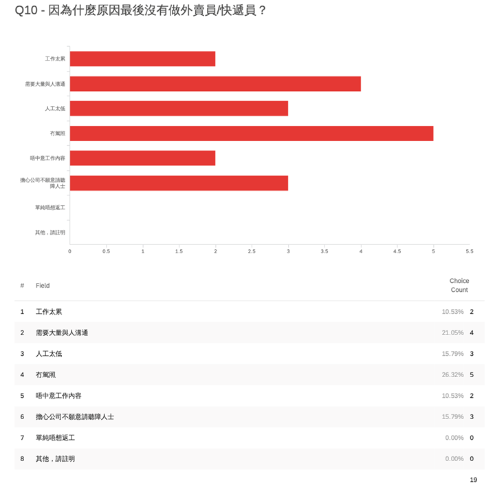
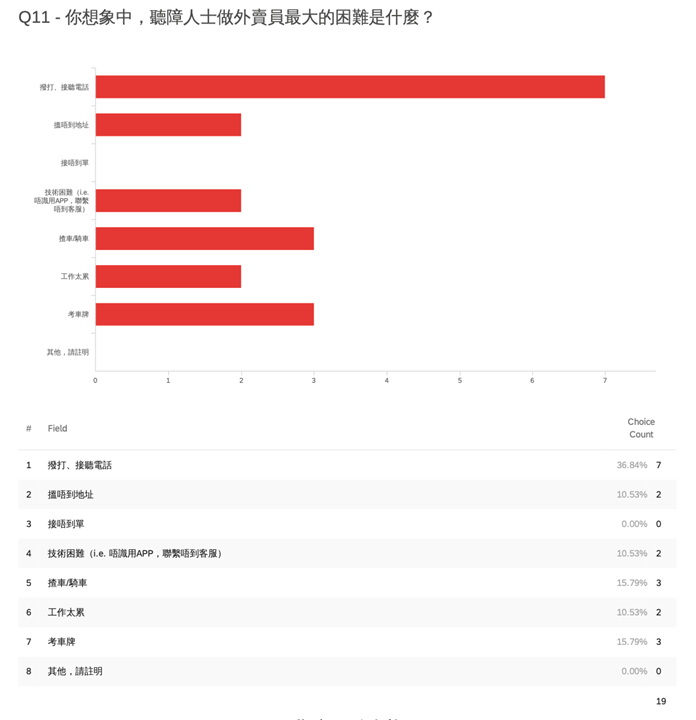
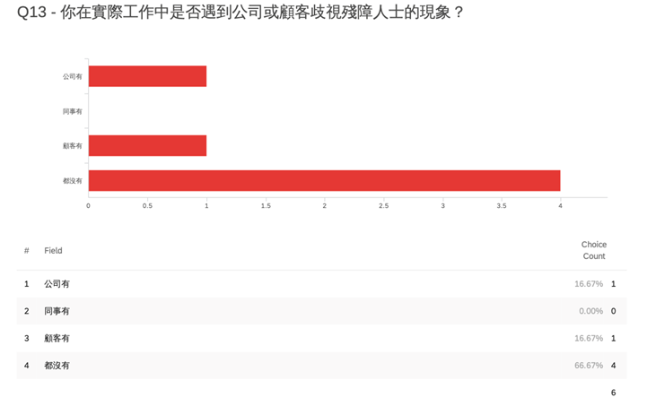

# Introduction

1.   The food delivery industry in Hong Kong (“**the industry**”) saw a major rise since the outbreak of COVID-19. In 2023, Mei Tuan (美團), the largest food delivery platform in China, is also reportedly planning to enter the Hong Kong market. 

2.   Contrast the flourishing industry, little attention has been drawn to the food delivery persons (**“riders”**) with disabilities in Hong Kong. In Mainland China, public attention has been drawn to hearing-impaired riders (“**HIRs**”) through either newspapers or social media, as their disability poses certain difficulties to their job, but does not constitute an absolute bar. 

3.   Upon our preliminary research, it is noticed that not much light has been cast on this group. Therefore, we proposed, as our final year project, to-

     (1) discover the employment hurdles of the HIRs in Hong Kong, if any, through interviews and surveys, thereby generating a report; and 

     (2) endeavour to solve the problems discovered in the report using the methods mentioned. 

4.   To identify the hurdles, we conducted a survey (“**the** **survey**”) with the assistance of The Hong Kong Society for the Deaf (“**HKSD**”). 27 hearing-impaired persons (“**HIPs**”) participated in the survey, the results of which are attached in Appendix 1. In addition, with the assistance of a few other organisations,[[1]](#_ftn1) and also by promoting our project on Facebook, we interviewed a few HIPs and HIRs (“**the interviews**”).[[2]](#_ftn2) The survey and the interviews constitute our main sources of data in the report.

5.   Now, we conclude our report. 

# Broad Employment Situation

6.   It is imperative to set out broadly the present employment situation of HIRs before entering the discussion of their hurdles. 

7.   According to one of our HIR interviewees, insofar as he was aware, there are presently at least more than 10 HIRs employed by the two major food delivery platforms (“the platforms”), Foodpanda and Deliveroo, in Hong Kong. Additionally, HIRs are also hired by small businesses, the numbers of which are unascertainable. 

8.   There is no systematic discrimination or bias against HIRs in the industry. Amongst the 5 HIRs participating in the survey, only 1 complained about the existence of any discrimination. Additionally, no complaint was received during the interviews. On the contrary, one HIR interviewer positively said that he felt he was treated equally to others. 

# Employment Hurdles

9.   It is understood that potential employment hurdles consist of two stages. First, whether the HIRs are treated discriminatorily in the hiring stage. Second, whether they have any difficulties during their work because of their disabilities. 

10.  Upon our interviews with HIRs, it is discovered that though it is stated in the major platforms’ recruiting policies that interviews will be arranged for the riders’ job applications, no substantive scrutiny is carried out therein, such that the platforms would not know whether an applicant is hearing-impaired.[[3]](#_ftn3) Therefore, discrimination at this stage is unlikely to exist.

11.  One interviewee mentioned that when the platform he is working for later learnt that he is hearing-impaired, no action or enquiry took place.[[4]](#_ftn4)

12.  That said, it is worth noting, as corroborated by the survey, that the concern about potential discrimination is one of the major factors deterring HIPs from being riders.[[5]](#_ftn5)

13.  Regarding the second stage, as indicated by the 5 HIRs participating in the survey, the most common hurdle is the difficulty of making phone calls. This difficulty was further broken down in the interviews into 3 parts: 

     (1)  the difficulty in communicating with the waiters at the restaurants. Usually, it suffices for the HIRs to show the orders on their phone to the waiters, and no communication is necessary. However, occasionally, some waiters may require the HIRs to check and confirm that they got the right food. This is when miscommunications may happen;

     (2)  the difficulty when called by the customers. It is not mandatory for the HIRs to call the customers, but sometimes the customers may call them. According to an HIR interviewee, if called by customers, he would have to hang up the phone call first and then send a message to the customer indicating his hearing conditions and inviting them to text back; and

     (3)  the difficulty in communication with the platforms. Sometimes, the platforms may call, instead of text, the HIRs regarding certain issues. This may cause some trouble to the HIRs, especially when they are not aware of the existence of the issues, e.g. missing food.

14.  Another difficulty is with driving or riding motor vehicles. An interviewee asserted that the platforms accord priority to the delivery persons with vehicles when assigning orders. However, it is difficult for HIPs to acquire driving permits and risky for them to drive. Albeit commercially sensible, the platforms’ policy in favour of vehicles may be indirectly discriminatory against HIPs, so much so that 4 HIPs in the survey indicated that they decided not to be HIRs because they do not hold driving permits.

15.  An HIP interviewee with single-sided deafness mentioned that she has to be very cautious when she crosses roads, as she could not identify the location of a detected sound of a car. She is not an HIR, but she considered it dangerous for HIPs with serious disabilities to be riders, as riders are expected to quickly cross many roads.

16.  The 3 major difficulties are listed above. There are also other lesser difficulties. For example, it takes more effort for an HIR to get gate access from the security guards of properties. However, these difficulties can be easily overcome and are, therefore, regarded trivial for the purpose of this report. 

# Solutions

17.  The employment hurdles are discussed above, now, we propose some potential solutions to them. 

18.  Before the discussion of the solutions, it must be emphasised that HIRs, as we observed, are perfectly capable of performing their tasks efficiently and that they have been working very hard to overcome the difficulties. It is desirable to offer them more assistance for the benefit of a fair society, but it would be wrong to suggest that their capabilities as riders are inferior to those of others.

19.  In the hiring stage, the major problem is HIPs’ concern about discrimination. Yet, there is no evidence suggesting the existence of any discrimination in the industry. If HIPs’ concern is solved, they would have one more attractive employment option.[[6]](#_ftn6) Two things may be done to address this problem:

     (1)  The platforms clearly state in their recruitment policies that disabilities do not automatically disqualify applicants; and

     (2)  We film and publish a documentary (“**the documentary**”) showing that an HIP can work as a rider as efficiently as others, such that the public does not underestimate their capability. 

20.  In the working stage, we consider that the problems can only be solved by the platforms. Therefore, we drafted a series of guidelines (“**the guidelines**”) as set out in Appendix 3 for the platforms to facilitate the employment of HIRs, should they so desire. Since our influence is limited, we decide to try to persuade certain influential organisations to publish the guidelines for us, such that they may carry more influence should the platforms decide to address the problems.

21.  However, it is understood that the platforms’ primary object is commercial interest. Therefore, we must link the welfare of HIRs and the platforms’ commercial interest by raising public awareness of HIRs’ employment hurdles.[[7]](#_ftn7) In particular, we decide to-

     (1)  also show the hurdles faced by the HIRs in the said documentary; and

     (2)  publish this report to attract public attention.

# Summary

22.  To sum up, HIRs are commonly employed in Hong Kong by both the platforms and small businesses. There is no systematic discrimination against them. 

23.  HIRs’ main hurdles include-

     (1)  their concerns of potential discrimination; 

     (2)  difficulties associated with phone calls; 

     (3)  difficulties with driving and riding motor vehicles; and

     (4)  risks when crossing the roads. 

24.  To solve the hurdles, we purport to-

     (1)  publish the guidelines for the platforms; 

     (2)  persuade influential organisations to publish the guidelines; and

     (3)  film and publish a documentary.

 
 
 
 
 
 

Appendix 1

Survey Results

 
 
 
 
 
 

Appendix 2

Selected Interview Records

1. The following conversation took place:

| WeHeard  Group: | 你之前提到可以網上面試，請問網上面試要做乜嘢？是否需要同hr交流？ |
| --------------- | ---------------------------------------------------------------- |
| Interviewee:    | 只係給身份證證明，銀行戶口及自拍，無經hr 交流                    |
| WeHeard  Group: | 咁所有人申請做外賣員都無需面試？只需提交證明？                   |
| Interviewee:    | 是                                                               |
| Interviewee:    | 今日到美團招聘會也不需要面試吧！                                 |
| WeHeard  Group: | 因為係網上見到有熊貓外賣員講需要面試，甚至英文自我介紹           |
| WeHeard  Group: | 美圖應該都唔需要面試                                             |
| WeHeard  Group: | 我以為香港需要                                                   |
| Interviewee:    | 之前我申請熊貓外賣也沒需面試                                     |

2. The following conversation took place:

| WeHeard  Group: | 搵呢份工嘅時候，是否有遇到對於聽障人士不方便嘅嘢？譬如電話面試？或者平台招聘存在歧視？ |
| --------------- | -------------------------------------------------------------------------------------- |
| Interviewee:    | 只是申請網上面試就掂，日後外賣公司知道我的真相，但讓我繼續做，因為知道客戶對我滿分。   |

3. The following conversation took place:

| WeHeard  Group: | 您對聽障人士做外賣員有什麼看法嗎，以及在什麼方面會有困難?                                                                                                                                                                                                                                                                                                                                                                                                                                                                                                                                                                                                                 |
| --------------- | ------------------------------------------------------------------------------------------------------------------------------------------------------------------------------------------------------------------------------------------------------------------------------------------------------------------------------------------------------------------------------------------------------------------------------------------------------------------------------------------------------------------------------------------------------------------------------------------------------------------------------------------------------------------------- |
| Interviewee:    | 其實做外賣員是一個不錯的選擇，我們的一些會員，尤其是年輕的會員，相對來說比較喜歡自由一點，去做food panda， 可以不用每天上下班，做多少就賺多少，這個禮拜想多賺一點就可以多送幾單，沒有同事和老闆也可以避免一些溝通困難和情緒上的困擾，與同事的溝通，誤會誤解什麼的。但做外賣員同樣會遇到溝通上的問題，送貨時找不到地址沒法打電話啦，到店家取餐等餐的時候，因為聽不到，而店家往往都很忙，更不會有耐心與你溝通的，脾氣會有點差的。而且因為沒有一個固定的老闆，在遇到糾紛或困難時只能向客服求助，這就需要打字，其實聽障人士的說話方式，他們的思維方式妨礙到了他們的閱讀能力，表述時語序會和正常人不太一樣，而那些閱讀能力很好的人，能夠讀到學士學位，又不會想去做這些工作的。 |

 

 
 
 
 
 
 

Appendix 3

Guidelines

 

To facilitate the employment of hearing-impaired delivery persons, the food delivery platforms are advised to-

1.   clearly state in their recruitment policies that disabilities do not automatically disqualify applicants; 

2.   notify their customers as such when the delivery persons are hearing-impaired with appropriate measures. At the minimum, such notifications should appear in the mobile applications of the platforms, but this may not be enough, as the customers may not check the applications carefully. It is desirable to give them additional notifications, such as by email;

3.   contact hearing-impaired delivery persons by texts rather than phone calls; and

4.   when assigning orders, treat hearing-impaired delivery persons equally as delivery persons with motor vehicles, except insofar as one’s delivery capacity is concerned.

These guidelines are the most significant steps that should be taken, but the platforms are always advised to be guided by the ultimate aim of ensuring social fairness. A balance should be struck between the need to protect disadvantaged groups and the need to acknowledge their ability to live on themselves.

 
 
 
 
 
 

------

<a id="_ftn1">[1]</a> The organisations include the Hong Kong Rehabilitation Power and the Dignity Kitchen Hong Kong. 

<a id="_ftn2">[2]</a> Due to privacy concerns, the detailed records of the interviews will not be disclosed in the report.

<a id="_ftn3">[3]</a> See Appendix 2, paragraph 1.

<a id="_ftn4">[4]</a> See Appendix 2, paragraph 2.

<a id="_ftn5">[5]</a> 3 HIPs indicated that they decided not to be riders due to the concern about the potential discrimination.

<a id="_ftn6">[6]</a> In the survey, 18 HIPs answered the question whether they have considered or have been working as riders. 12 of them answered in the affirmative. Additionally, as shown by the interview with HKSD at paragraph 3 of Appendix 2, food delivery is an attractive industry for HIPs. 

<a id="_ftn7">[7]</a> We have attempted to contact the platforms directly, but understandably we have received no response.

 
 

[Download Here](https://weheard.github.io/files/Report on the Hearing-impaired Delivery Persons' Hurdles.pdf)